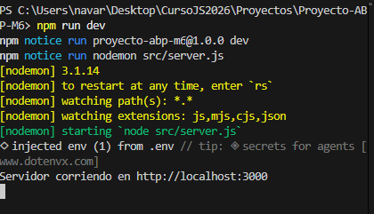
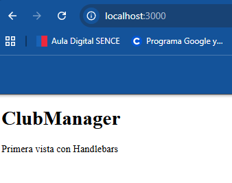
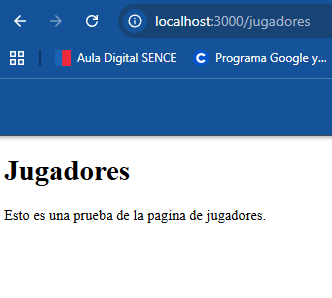
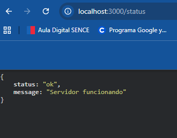
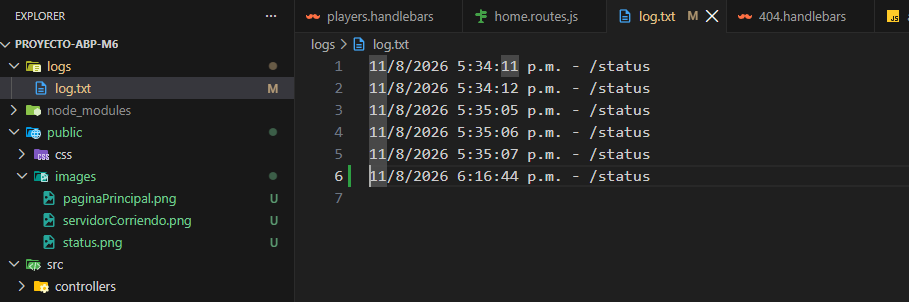
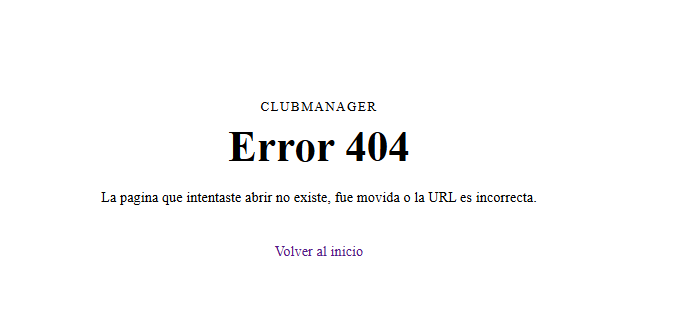
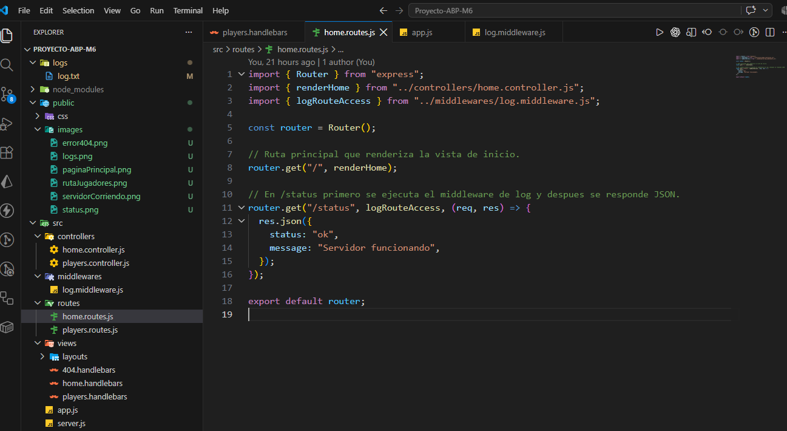

# ClubManager

Aplicacion web backend construida con Node.js y Express para la entrega academica del Modulo 6. El proyecto representa la base de `ClubManager`, una plataforma de gestion para clubes o equipos deportivos, usando como ejemplo inicial a `Club Prueba`.

En esta primera entrega el objetivo es dejar una base funcional, modular y documentada, con rutas publicas, vistas con Handlebars, archivos estaticos y persistencia simple en archivo plano.

## Descripcion

Esta version incluye:

- servidor Express funcional
- configuracion con `dotenv`
- logs HTTP con `morgan`
- vistas con `express-handlebars`
- archivos estaticos servidos desde `public/`
- rutas publicas `/`, `/jugadores` y `/status`
- pagina `404` personalizada
- registro de accesos en `logs/log.txt` usando `fs/promises`

## Requisitos

- Node.js 18 o superior
- npm
- Git

## Instalacion

1. Clonar el repositorio.
2. Instalar dependencias:

```bash
npm install
```

3. Crear un archivo `.env` en la raiz del proyecto a partir de `.env.example`.

Contenido minimo sugerido:

```env
PORT=3000
```

## Ejecucion

Modo desarrollo con reinicio automatico:

```bash
npm run dev
```

Modo normal:

```bash
npm start
```

## Scripts

- `npm run dev`: ejecuta el servidor con `nodemon` para reiniciar automaticamente al guardar cambios.
- `npm start`: ejecuta el servidor con Node.js en modo normal.

El proyecto usa `ES Modules` con `"type": "module"` en `package.json`, por eso los archivos trabajan con `import` y `export`.

Se eligio `src/server.js` como punto de entrada porque separa claramente el arranque del servidor de la configuracion de la aplicacion. La configuracion de Express vive en `src/app.js`.

## Rutas principales

- `/`: renderiza la vista principal con Handlebars.
- `/jugadores`: renderiza una vista de prueba para la seccion de jugadores.
- `/status`: devuelve una respuesta JSON para comprobar el estado del servidor.

Ejemplo de respuesta en `/status`:

```json
{
  "status": "ok",
  "message": "Servidor funcionando"
}
```

## Archivos estaticos

Los archivos estaticos se sirven desde `public/` usando `express.static()`.

Ejemplo actual:

- `public/css/output.css`

## Registro en archivo plano

La ruta `/status` utiliza un middleware propio para registrar accesos en `logs/log.txt`.

Cada linea guarda:

- fecha
- hora
- ruta accedida

Ejemplo:

```text
11/8/2026 5:34:11 p.m. - /status
```

Se eligio este mecanismo para cumplir la persistencia simple pedida en la primera entrega, sin incorporar todavia base de datos.

## Evidencias

### Servidor en funcionamiento



### Ruta principal `/`



### Ruta `/jugadores`



### Ruta `/status`



### Registro en `logs/log.txt`



### Pagina 404 personalizada



### Estructura modular del proyecto



## Estructura del proyecto

```text
Proyecto-ABP-M6/
├── logs/
│   └── log.txt
├── public/
│   └── css/
│       └── output.css
├── src/
│   ├── controllers/
│   │   ├── home.controller.js
│   │   └── players.controller.js
│   ├── middlewares/
│   │   └── log.middleware.js
│   ├── routes/
│   │   ├── home.routes.js
│   │   └── players.routes.js
│   ├── views/
│   │   ├── layouts/
│   │   │   └── main.handlebars
│   │   ├── 404.handlebars
│   │   ├── home.handlebars
│   │   └── players.handlebars
│   ├── app.js
│   └── server.js
├── .env.example
├── .gitignore
├── AGENTS.md
├── package.json
└── README.md
```

## Decisiones tecnicas

- Se uso `app.js` para concentrar la configuracion de Express y `server.js` para iniciar el servidor.
- Se eligio `express-handlebars` para trabajar con vistas reutilizables y separar layout de contenido.
- Se modularizaron rutas, controladores y middlewares para dejar una base escalable para las siguientes entregas.
- Se uso `public/` para servir recursos estaticos de forma simple y clara.
- Se implemento persistencia en archivo plano con `fs/promises` porque la consigna del Modulo 6 aun no requiere base de datos.

## Reflexion tecnica

- Express simplifica el manejo de rutas, middlewares y respuestas frente a trabajar solo con Node.js puro.
- La separacion entre `src/app.js` y `src/server.js` deja mas clara la diferencia entre configurar la aplicacion e iniciar el servidor.
- El uso de `express-handlebars` permitio servir HTML con una estructura reutilizable, separando layout y vistas.
- La modularizacion en `routes/`, `controllers/` y `middlewares/` deja una base ordenada para la siguiente etapa con base de datos y ORM.
- El registro en `logs/log.txt` con `fs.appendFile()` resuelve la persistencia simple pedida por la consigna sin sobredisenar la solucion antes de tiempo.
- La estructura actual deja el proyecto listo para integrar persistencia real y operaciones CRUD en el Modulo 7.

## Estado de la entrega 1

Actualmente el proyecto ya cumple con:

- servidor Express funcional
- scripts `start` y `dev`
- configuracion de `dotenv`
- uso de `nodemon`
- rutas publicas
- respuesta HTML y JSON
- carpeta `public/` funcionando
- registro simple en archivo plano
- estructura modular basica
- pagina 404 personalizada

## Checklist de cumplimiento

- Node.js y Express configurados y funcionando
- `dotenv`, `morgan` y `nodemon` instalados y usados correctamente
- `app.js` y `server.js` separados por responsabilidad
- rutas publicas `/` y `/status` implementadas
- respuesta HTML y respuesta JSON verificadas
- carpeta `public/` servida con `express.static()`
- registro de accesos en `logs/log.txt` con `fs.appendFile()`
- estructura modular con `controllers`, `routes` y `middlewares`
- pagina 404 personalizada
- README con instalacion, ejecucion, decisiones tecnicas y evidencias

## Proyeccion de modulos 7 y 8

En siguientes entregas `ClubManager` se extendera con:

- base de datos real
- ORM
- CRUD de entidades principales
- relaciones entre modelos
- API RESTful
- autenticacion con JWT
- rutas protegidas
- subida de archivos

Estas partes no forman parte del alcance actual del Modulo 6.
